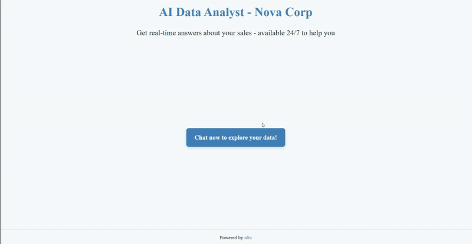
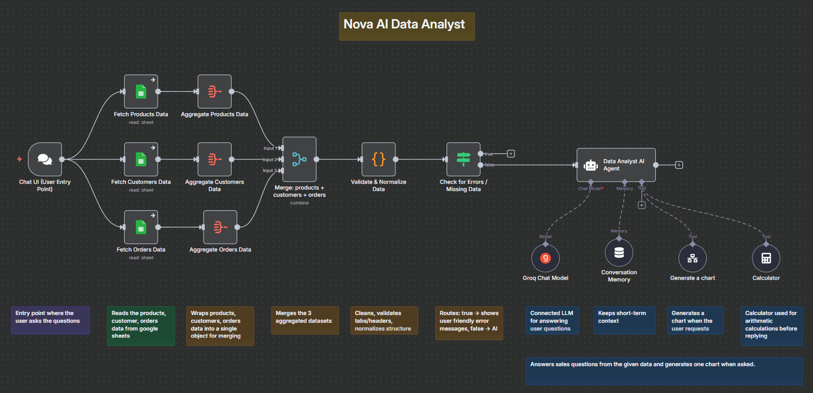

# 🤖 Nova — AI Data Analyst Chatbot (n8n + Groq + Google Sheets)

A local, privacy-friendly chatbot that answers **sales questions** from your **Google Sheet** using **n8n** workflows, **Groq** LLMs, and a clean, branded chat UI. It validates/normalizes data, returns transparent calculations, and can render charts via **QuickChart**.

> The core idea: show how free tools and open models can analyze your own data locally. The demo uses sales data (a common use case), but you can adapt it to any dataset.

<p align="center">
  
</p>

## ✨ What it does

- 🧠 Natural-language Q&A over **Products**, **Customers**, and **Orders**
- 🧼 Defensive data layer: header checks, missing/empty tab detection, day-first date parsing, numeric coercion
- 🧾 Transparent analytics: lists **order IDs**, shows subtotals/totals, formats currency (%) with two decimals
- 🧮 Programmatic math only: uses a calculator/tool (no hand-added sums)
- 🧰 Composable: agent can call a **chart sub-workflow** that returns a rendered image URL
- 🧷 Short-term memory: remembers the last few turns
- 🎨 Clean, branded chat UI (custom CSS)
- 🔒 Local-first: runs on your machine; you own the data

### Workflows

- **Main AI Agent:** `AI Data Analyst Chatbot`
- **Sub-workflow:** `Generate Chart` (invoked when the user requests a chart/graph)

## 🧱 Architecture



## 💬 Usage

Ask:

- "Total revenue for September?"
- "Top 5 customers by spend"
- "Products low on stock (< 10)"
- "Revenue by category last 3 months"
- "Monthly revenue for Jan–Jun and the trend (chart)?"
- "Which category brings in the most money?"
- "Who are our top 3 customers and which cities buy the most?"

The bot will:

- Validate your sheet structure
- Compute metrics programmatically
- List **order IDs** per month/segment
- Generate **one chart** when asked or when it clearly finalizes the answer

A ready-made Excel template is included at `data/sample-sales-data-template.xlsx` or [Google Sheet link](#)

> For detailed setup, internals, and troubleshooting, see **[docs/DETAILED_README.md](docs/DETAILED_README.md)**.

---

## 🗂️ Repo Structure
```text
├─ workflows/
│  ├─ ai-data-analyst-chatbot.json    # Main n8n workflow (Chat, Sheets, Validate, Agent, Tools)
│  └─ generate-chart.json             # Sub-workflow (Chart.js v2 config → QuickChart)
├─ data/
│  └─ sample-sales-data-template.xlsx # Sheet template with required tabs/headers
├─ assets/
│  ├─ demo.mp4                        # Short demo video
│  ├─ demo.gif                        # Demo preview (for README)
│  ├─ architecture.png                # System architecture diagram
│  └─ chat-ui-screenshot.png          # Screenshot of the chat UI
├─ docs/
│  ├─ SETUP.md                        # Installation and setup guide
│  ├─ DETAILED_README.md              # In-depth developer documentation
│  └─ TROUBLESHOOTING.md              # Common issues and solutions
├─ .gitignore
├─ LICENSE
└─ README.md
```

## 🛣️ Improvements in Progress

- Ingest once; **store in DB** (SQL or vector DB) and update on change (better for large datasets)
- Extend **memory** beyond short-term
- Additional connectors and source types

## 🧩 Why this project

- **Workflow design:** clean node graph with clear separation of concerns
- **Robustness:** strong pre-checks, exact header enforcement, helpful errors
- **Prompt design:** rules that enforce programmatic math, transparency, and chart discipline
- **Dev ergonomics:** clear setup, sample data, and branding hooks
